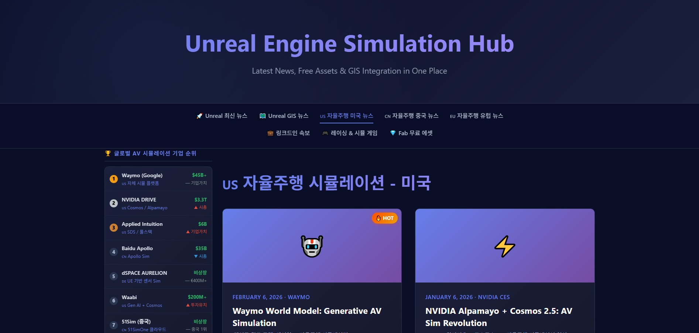
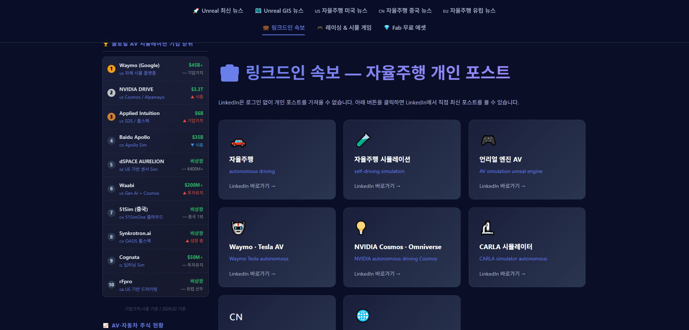
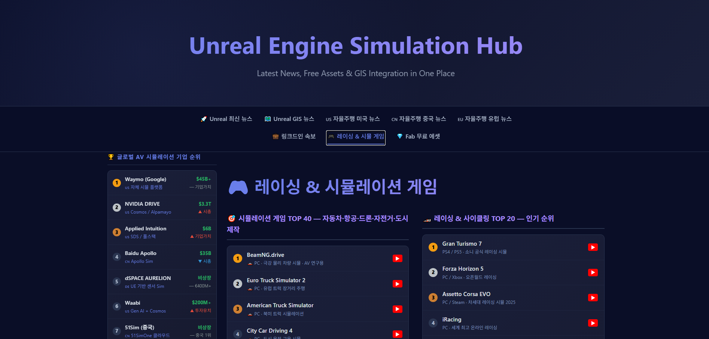
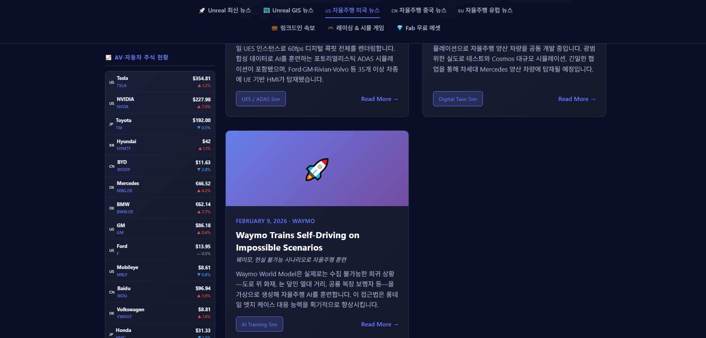
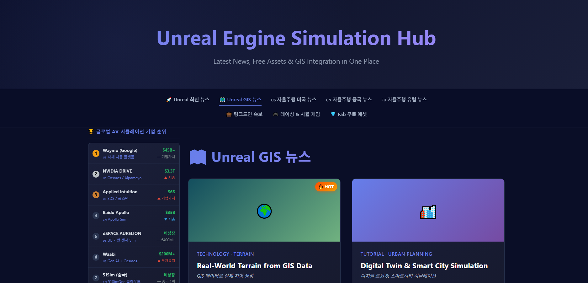

# Unreal Engine Hub

  
  
  
  
  
  

<em>Click an image to view it at full size. / 이미지를 클릭하면 크게 볼 수 있습니다.</em>

## English

Unreal Engine Hub is a web dashboard that brings together Unreal Engine news, free assets, learning resources, and autonomous-driving simulation content in one place. It is designed as a practical information hub for developers and researchers who want to track the Unreal Engine ecosystem without searching across multiple sites.

### Highlights

- Curated Unreal Engine news with article thumbnails and source links
- Free asset and learning-resource discovery
- Autonomous-driving and simulation content
- Sidebar rankings and frequently updated information
- Automated news/data refresh through GitHub Actions
- Static deployment through GitHub Pages

### Tech Stack

- HTML, CSS, and JavaScript
- Python data collection
- News API integration
- GitHub Actions and GitHub Pages

### Live Site

[Open Unreal Engine Hub](https://dinoston.github.io/UnrealEngineHub/)

---

## 한국어

Unreal Engine Hub는 언리얼 엔진 최신 뉴스, 무료 에셋, 학습 자료와 자율주행 시뮬레이션 관련 정보를 한곳에서 확인할 수 있도록 만든 웹 대시보드입니다. 여러 사이트를 따로 검색하지 않고 언리얼 엔진 생태계의 주요 정보를 빠르게 확인하려는 개발자와 연구자를 위한 프로젝트입니다.

### 주요 기능

- 기사 이미지와 원문 링크가 포함된 언리얼 엔진 뉴스 제공
- 무료 에셋과 학습 자료 탐색
- 자율주행 및 시뮬레이션 관련 콘텐츠 제공
- 순위 사이드바와 주기적으로 갱신되는 정보
- GitHub Actions를 이용한 뉴스·데이터 자동 업데이트
- GitHub Pages 기반 정적 웹사이트 배포

### 기술 구성

- HTML, CSS, JavaScript
- Python 데이터 수집
- News API 연동
- GitHub Actions 및 GitHub Pages

### 웹사이트

[Unreal Engine Hub 열기](https://dinoston.github.io/UnrealEngineHub/)
